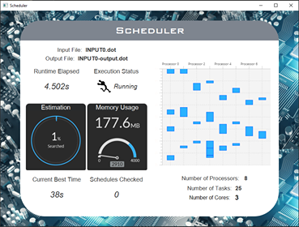

# SOFTENG 306 Project 1
This project involves a fast algorithm to solve optimal-task scheduling on multiple processors which is an NP-hard problem.

The team has implemented two algorithms, which are sequential and parallel versions of Depth-first Search (DFS) Branch and Bound.
With DFS Branch and Bound, there is low memory usage. The user can specify the amount of cores they want to use when
running the parallel version. 

We have implemented a visualiser for the user to see the optimal task allocation, 
current progress and other useful and interesting information for the algorithm, including memory usage and number of
schedules checked.

## Team Profile - The Lucky One
| Name                | UPI     | Github Username                                   |
| ------------------- | ------- | ------------------------------------------------- |
| Lucas Gao           | ygao979 | [lucas2005gao](https://github.com/lucas2005gao)   |
| Jiawei Ge           | jge385  | [jge385](https://github.com/jge385)               |
| Tommy Shi           | yshi428 | [tommyshi55](https://github.com/tommyshi55)       |
| Martin Tiangco      | mtia116 | [MartinTiangco](https://github.com/MartinTiangco) |
| Ziwei Yang          | zyan225 | [zyan225](https://github.com/zyan225)             |
| Will Zhang          | yzhb120 | [Will-ZYS](https://github.com/Will-ZYS)           |

## Project Setup in IDE
1. Clone the repository
    ```
    https://github.com/SoftEng306-2020/project-1-the-lucky-1.git         
    ```
2. Import the project as Gradle project in IntelliJ

## Building the Project
To build an executable jar of the project, run the following on the command line:
```
./gradlew build
```
The generated jar file will be placed under the `build/libs` directory

## Running the Project
To run the executable jar file, run
```
java -jar <jarfilename.jar> [OPTIONS...]
```
The detailed usage of the application is the following:
```
Usage: java -jar scheduler.jar INPUT.dot P [OPTIONS]
INPUT.dot (A task graph with integer weights in dot format, need to be placed in the same directory as the jar file or the project root)
P (The number of processors to schedule the INPUT graph on

Optional:
-p N (Use N core for execution in parallel, default is sequential, not implemented for Milestone 1)
-v (Visualise the search, not implemented yet)
-o OUTPUT (Output file is named OUTPUT, default is INPUT-output.dot)
```

The project can also be run in Gradle, just run
```
./gradlew run --args='OPTIONS...'
```
in the project root folder

Or, run the build.gradle script in IntelliJ with the arguments:
```
run --args='OPTIONS...'
```
## Visualisation


Use the optional `-v` flag to display the visualisation. 
The visualisation shows useful statistics which include:
* The current task allocation and ordering on the processors at the point in time 
* Current best time of the schedule
* Execution status and runtime measurements
* Memory usage
* Estimation of completion
* The number of schedules checked
* Input and Output file names


## Documentation
* [Meeting Minutes](https://github.com/SoftEng306-2020/project-1-the-lucky-1/tree/master/wiki/meetingNotes)
* [Project Changelog](https://github.com/SoftEng306-2020/project-1-the-lucky-1/blob/master/wiki/changedLog.md)
* [Architecture](https://github.com/SoftEng306-2020/project-1-the-lucky-1/blob/master/wiki/architecture.md)
* [Team Collaboration](https://github.com/SoftEng306-2020/project-1-the-lucky-1/blob/master/wiki/teamCollaboration.md)
* [Visualization Design](https://github.com/SoftEng306-2020/project-1-the-lucky-1/blob/master/wiki/visualizationDesign.md)
